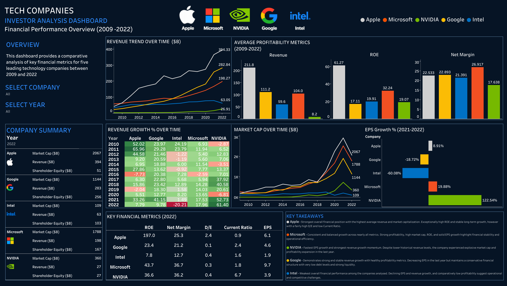

# 📊 André Bergvind | Analytics Portfolio

👋 Hi, I'm André Bergvind

Business Graduate | Google Data Analytics Certificate Holder

Turning business data into actionable insights through analytics, visualisation, and structured problem-solving.

## Featured Projects

📈 Financial Analysis • 🚚 Operations Analysis • 🚲 Consumer Behaviour Analysis • 🧠 Cognitive Performance Analysis

---

## 📈 Big Tech Financial Analysis

  

### A financial analysis of five major tech companies and their performance between 2009 and 2022

**Objective:**
Provide insights to support investment decision-making.

**Skills Demonstrated:**
Data Cleaning • Financial Analysis • Data Visualisation • Financial Decision-Making

🔗 [Tableau Dashboard](https://public.tableau.com/views/TechCompaniesFinancialAnalysis/Dashboard1?:language=en-GB&:sid=&:redirect=auth&:display_count=n&:origin=viz_share_link) 🔗 [Project Repository](https://github.com/andrebergvind/big-tech-financial-analysis.git) 

---
## 🚚 Glovo Delivery Performance Analysis
  

### An operations and logistics data analysis project analysing delivery performance data from Glovo

**Business Goal:**
Identify patterns associated with late deliveries and support operational improvements.

**Skills Demonstrated:**
Data Cleaning • SQL • Operational Analysis • Data Visualisation

🔗 [Tableau Dashboard](https://public.tableau.com/views/GlovoE-CommerceAnalysis/Dashboard1?:language=en-GB&:sid=&:redirect=auth&:display_count=n&:origin=viz_share_link) 
🔗 [Project Repository](https://github.com/andrebergvind/glovo-delivery-performance-analysis.git)

---
## 🚲 Cyclistic Bike Share Analysis

### A consumer behaviour data analysis project, part of the Google Data Analytics course

**Business Goal:**
Convert casual riders into annual members.

**Skills Demonstrated:**
Data Cleaning • SQL • Data Visualisation • Behavioural Analysis

🔗 [Tableau Dashboard](https://public.tableau.com/views/CyclisticAnalysis_17737226068460/UserBehaviourOverview?:language=en-GB&:sid=&:display_count=n&:origin=viz_share_link)  🔗 [Project Repository](https://github.com/andrebergvind/Cyclistic-bike-share-analysis) 

---
## 🧠 Exercise & Student Cognitive Performance Analysis
  

### A research project exploring the relationship between exercise, cognitive functioning, and short-term academic productivity among university students

**Research Goal:**
Contribute to a deeper understanding of the relationship between physical activity and cognitive outcomes, while also providing practical recommendations that may help students optimise their exercise routines to enhance productivity.

**Skills Demonstrated:**
Survey Research • Data Cleaning • Data Visualisation • Quantitative Analysis • Qualitative Analysis 

🔗 [Tableau Dashboard](https://public.tableau.com/views/CapstoneProjectExerciseandAcademicProductivityAnalysis/CognitiveEffectsofExercise?:language=en-GB&:sid=&:redirect=auth&:display_count=n&:origin=viz_share_link)  🔗 [Project Repository](https://github.com/andrebergvind/Capstone-Project-exercise-productivity-analysis.git)

---
## 📫 Contact

💼 [LinkedIn](https://www.linkedin.com/in/andrebergvind/) | 
📊 [Tableau Public](https://public.tableau.com/app/profile/andr.bergvind/vizzes) | 
✍️ [Medium](https://medium.com/@andrebergvind)
